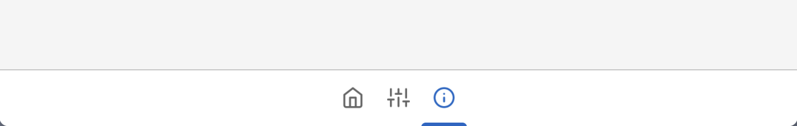

---
tags:
  - View
  - Components
  - Window
  - Tabs
---

# AppTabBar



AppTabBar is used to add tab support to your window, this could be used to let users navigate between different pages intuitively. Used together with [AppTabBarButton](../Controls/Buttons/AppTabBarButton.md) and [BottomAppBar](./BottomAppBar.md).

## Usage
AppTabBar can be created by calling `Lydie.Components.View.AppTabBar`:

```lua
local tabStates = {
	Home = Fusion.Value(true),
	Settings = Fusion.Value(false),
	About = Fusion.Value(false),
}

local function tabOnClick(state)
	state:set(true)
	for _, tabState in pairs(tabStates) do
		if tabState ~= state then
			tabState:set(false)
		end
	end
end

Lydie.Components.View.AppTabBar {
    [Fusion.Children] = {
        AppTabBarButton {
            Icon = Icons.home,
            State = tabStates.Home,
            OnClick = tabOnClick,
        },

        AppTabBarButton {
            Icon = Icons.sliders,
            State = tabStates.Settings,
            OnClick = tabOnClick,
        },

        AppTabBarButton {
            Icon = Icons.info,
            State = tabStates.About,
            OnClick = tabOnClick,
        },
    },
},
```

## Properties
| Name        | Description                          | Required | Default |
| ----------- | ------------------------------------ | -------- | ------- |
| `ZIndex` | The Z index of the button, used to show hierarchy of the button. | :x: | `1` |
| `[Fusion.Children]` | The children of the tab bar, this is used to insert [AppTabBarButton](../Controls/Buttons/AppTabBarButton.md) into the list | :x: | `nil` |