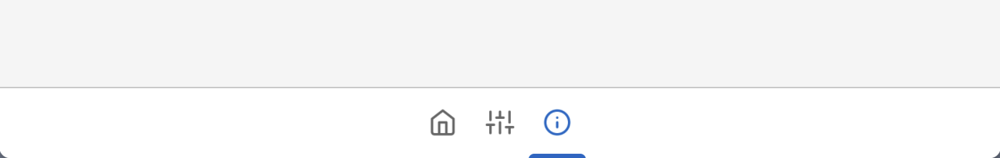

---
tags:
  - View
  - Components
  - Window
---

# BottomAppBar



BottomAppBar is the app bar shown at the bottom part of the window. Used together with [AppBarButton](../Controls/Buttons/AppBarButton.md) or [AppTabBar](./AppTabBar.md).

## Usage
BottomAppBar can be created by calling `Lydie.Components.View.BottomAppBar`:

```lua
Lydie.Components.View.BottomAppBar {
    ZIndex = 2,

    [Fusion.Children] = {
        Lydie.Components.View.AppTabBar { ... }
    },
}
```

## Properties
| Name        | Description                          | Required | Default |
| ----------- | ------------------------------------ | -------- | ------- |
| `ZIndex` | The Z index of the button, used to show hierarchy of the button. | :x: | `1` |
| `[Fusion.Children]` | The children of the bottom bar, this is often used to insert [AppTabBar](./AppTabBar.md) into the list | :x: | `nil` |