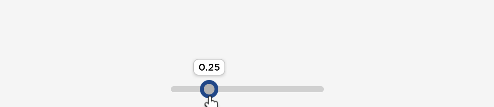

---
tags:
  - View
  - Components
---

# ToolTip



ToolTip is used to show additional but not essentially important information about an object. This is currently used in [Slider](../Controls/Slider.md).

## Usage
ToolTip can be created by calling `Lydie.Components.View.ToolTip`:

```lua
Lydie.Components.View.ToolTip {
    Text = "Hello, world!",
    Visible = true,
},
```

## Properties
| Name        | Description                          | Required | Default |
| ----------- | ------------------------------------ | -------- | ------- |
| `Text` | The text string of the tooltip | :white_check_mark: | `nil` |
| `AnchorPoint` | The anchor point of the tooltip | :x: | `Vector2.new(0.5, 1)` |
| `Position` | The relative position of the tooltip | :x: | `UDim2.new(0.5, 0, 0, -6)` |
| `Visible` | The visibility of the tooltip | :x: | `true` |
| `[Fusion.Children]` | The children of the window container | :x: | `nil` |