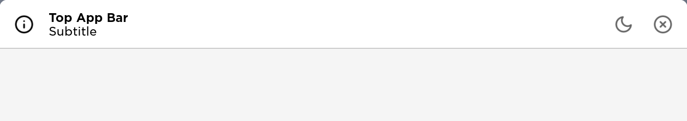

---
tags:
  - View
  - Components
  - Window
---

# TopAppBar



TopAppBar is the app bar shown at the top part of the window. Used together with [AppBarButton](../Controls/Buttons/AppBarButton.md). This is usually required.

## Usage
TopAppBar can be created by calling `Lydie.Components.View.TopAppBar`:

```lua
local windowVisible = Fusion.Value(true)

Lydie.Components.View.TopAppBar {
	Icon = Icons.info,
	Subtitle = Fusion.Value("Subtitle"),
	Title = Fusion.Value("Top App Bar"),
	ZIndex = 2,

	[Fusion.Children] = {
		Fusion.New "UIPadding" {
			PaddingRight = UDim.new(0, 5),
		},

		Lydie.Components.Controls.AppBarButton {
			Icon = Icons["x-circle"],
			LayoutOrder = 2,

			OnClick = function()
				windowVisible:set(false)
			end,
		},
	}
}
```

## Properties
| Name        | Description                          | Required | Default |
| ----------- | ------------------------------------ | -------- | ------- |
| `ZIndex` | The Z index of the button, used to show hierarchy of the button. | :x: | `1` |
| `[Fusion.Children]` | The children of the top bar, this is often used to insert [AppBarButton](../Controls/Buttons/AppBarButton.md) into the list | :x: | `nil` |