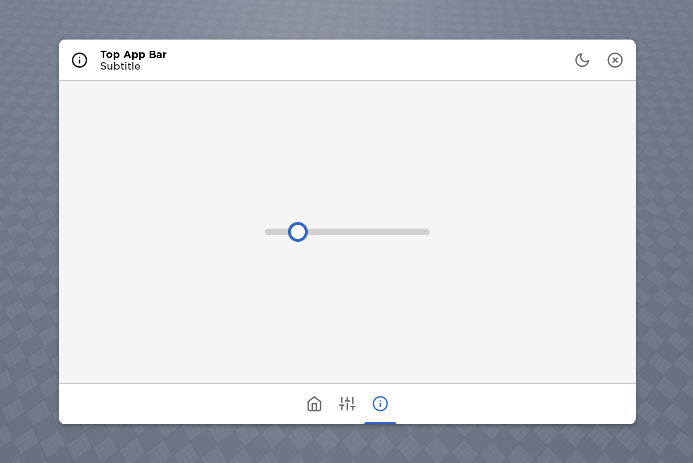

---
tags:
  - View
  - Components
  - Window
---

# Window



Window is the main container to display the content of a UI. This is often used together with [TopAppBar](./TopAppBar.md) and [BottomAppBar](./BottomAppBar.md).

!!! note
    
    Window has already set `AnchorPoint` to `Vector2.new(0.5, 0.5)`.

## Usage
Window can be created by calling `Lydie.Components.View.Window`:

```lua
Lydie.Components.View.Window {
    [Fusion.Children] = {
        Lydie.Components.View.TopAppBar { ... },

        Fusion.New "Frame" {
            BackgroundTransparency = 1,

            Position = UDim2.fromOffset(0, 50),
            Size = UDim2.new(1, 0, 1, -100),

            [Fusion.Children] = { ... }
        }

        Lydie.Components.View.BottomAppBar { ... },
    }
}
```

## Properties
| Name        | Description                          | Required | Default |
| ----------- | ------------------------------------ | -------- | ------- |
| `ZIndex` | The Z index of the window, used to show hierarchy. | :x: | `1` |
| `Position` | The relative position of the window | :x: | `UDim2.fromScale(0.5, 0.5)` |
| `Size` | The size of the window | :x: | `UDim2.fromOffset(700, 700)` |
| `Visible` | The visibility of the window | :x: | `true` |
| `[Fusion.Children]` | The children of the window container | :x: | `nil` |